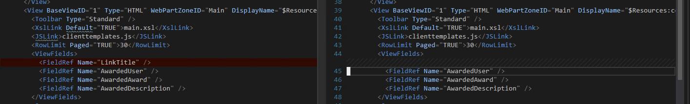
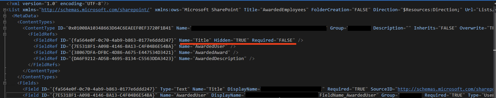
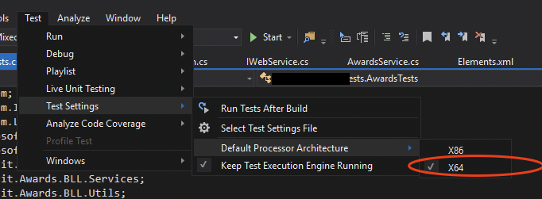

# Content

- [Content](#content)
  - [Object serialization](#object-serialization)
    - [Serialize](#serialize)
    - [Deserialize](#deserialize)
    - [Registering Wcf-service](#registering-wcf-service)
  - [WebService.svc](#webservicesvc)
    - [Strong name generation](#strong-name-generation)
    - [IWebService.cs](#iwebservicecs)
    - [WebService.svc.cs](#webservicesvccs)
  - [Xml field schema](#xml-field-schema)
    - [Choice](#choice)
    - [Boolean](#boolean)
    - [Number](#number)
    - [Note](#note)
    - [User](#user)
    - [Lookup](#lookup)
  - [Content type xml](#content-type-xml)
    - [Example of item-based content type](#example-of-item-based-content-type)
    - [Example of doclib-based content type](#example-of-doclib-based-content-type)
  - [List xml schema](#list-xml-schema)
    - [Removing (hiding) title field](#removing-hiding-title-field)
    - [List template of Regular list](#list-template-of-regular-list)
    - [List instance of Regular list](#list-instance-of-regular-list)
    - [List template of DocLib](#list-template-of-doclib)
    - [List instance of DocLib](#list-instance-of-doclib)
  - [Lookup fields](#lookup-fields)
    - [Set up lookup field](#set-up-lookup-field)
  - [Working with lists](#working-with-lists)
    - [Resolving list](#resolving-list)
    - [Deleting data](#deleting-data)
      - [Batch delete](#batch-delete)
    - [Getting items](#getting-items)
      - [All items](#all-items)
      - [Simple filtering](#simple-filtering)
      - [Filter by user-field](#filter-by-user-field)
    - [Adding/updating items](#addingupdating-items)
    - [Resolving field values](#resolving-field-values)
      - [SPUser](#spuser)
      - [LookupValue](#lookupvalue)
      - [DateTime](#datetime)
      - [Boolean](#boolean-1)
      - [Number](#number-1)
  - [Working with users](#working-with-users)
    - [Adding user claims to web](#adding-user-claims-to-web)
    - [Getting name without domain](#getting-name-without-domain)
  - [TimerJobs](#timerjobs)
    - [Feature activation](#feature-activation)
  - [Unit testing](#unit-testing)
    - [Running test case](#running-test-case)
    - [Solution deployment](#solution-deployment)
      - [Fast gac install](#fast-gac-install)

---

## Object serialization

### Serialize

```c#
var found = Locator.GetService<IEmployeeService>().GetAllEmployees(web.Site, request);
File.WriteAllText(@"C:\temp\get-all-employees.json", JsonConvert.SerializeObject(found));
```

### Deserialize

```c#
var fileContent = File.ReadAllText(@"C:\temp\get-all-employees.json");
var allEmployees = JsonConvert.DeserializeObject<EmployeesSearchResult>(fileContent);
```


### Registering Wcf-service

Add Mapped folder -> ISAPI
Add those files here:
## WebService.svc

```c#
<%@ ServiceHost Language="C#" 
    Factory="Microsoft.SharePoint.Client.Services.MultipleBaseAddressWebServiceHostFactory, Microsoft.SharePoint.Client.ServerRuntime, Version=16.0.0.0, Culture=neutral, PublicKeyToken=71e9bce111e9429c"
    Service="TestProject.ISAPI.TestProject.WebService, TestProject, Version=1.0.0.0, Culture=neutral, PublicKeyToken=96456a10469196f2" %>
```

Where service = *STRONG_NAME*

### Strong name generation

1. Title: _Strong Name_
2. Command: _Powershell.exe_
3. Arguments: _-command "[System.Reflection.AssemblyName]::GetAssemblyName(\"$(TargetPath)\").FullName"_
4. Check "Use output window"

### IWebService.cs
```c#
using System.ServiceModel;
using System.ServiceModel.Web;

namespace TestProject.ISAPI.TestProject
{
    [ServiceContract]
    interface IWebService
    {
        [OperationContract]
        [WebGet(UriTemplate = "test", ResponseFormat = WebMessageFormat.Json,
            BodyStyle = WebMessageBodyStyle.Bare )]
        string Test();
    }
}
```

### WebService.svc.cs
```c#
using System;
using System.Runtime.InteropServices;
using System.ServiceModel.Activation;

namespace TestProject.ISAPI.TestProject
{
    [Guid("54CD32E4-F11D-4CE3-81CA-216866A3F02E"),
            AspNetCompatibilityRequirements(RequirementsMode = AspNetCompatibilityRequirementsMode.Required)]
    public class WebService : IWebService
    {
        public string Test()
        {
            return "test wcf service";
        }
    }
}
```

## Xml field schema

If you are going to change definition of field during redeployment, it is very important to set attribute `Overwrite="TRUE"`, or schema will stay the same even after reinstalling of the solution.

Also, don't forget to reactivate site/web-level feature to deliver new schemas to endpoint.

### Choice
```xml
<Field
    ID="{9AA2ADFA-1516-43CF-859C-5383113716F4}"
    Name="Field"
    DisplayName="$Resources:TestProject, FieldName_Test"
    Type="Choice"
    Overwrite="TRUE"
    Format="Dropdown"
    Required="TRUE"
    Group="TestGroup">
    <CHOICES>
      <CHOICE>$Resources:TestProject, Value_Test1</CHOICE>
      <CHOICE>$Resources:TestProject, Value_Test2</CHOICE>
    </CHOICES>
  </Field>
```

### Boolean
```xml
<Field ID="{B08A6137-5B51-4DA5-8BA9-75DD703CC423}"
    Name="Field"
    DisplayName="$Resources:TestProject, FieldName_Test"
    Type="Boolean"
    Overwrite="TRUE"
    Group="TestGroup">
</Field>
```
### Number
```xml
<Field
    ID="{A89357D4-9863-4377-8C1E-9482A7EBED85}"
    Name="Field"
    DisplayName="$Resources:TestProject, FieldName_Test"
    Type="Number"
    Overwrite="TRUE"
    Required="TRUE"
    Group="TestGroup">
    <Default>35</Default>
</Field>
```

### Note
```xml
<Field 
    ID="{DA6F9212-AD5B-4695-8134-C5563DDA3423}" 
    Name="Field"
    DisplayName="$Resources:TestProject, FieldName_Test" 
    Group="TestGroup" 
    Required="FALSE" 
    Type="Note" 
    RichText="TRUE" 
    RichTextMode="Compatible" 
    NumLines="6"
    Overwrite="TRUE">
</Field>
```
### User
```xml
<Field
    ID="{7E5318F1-A09B-4146-BA13-C4F04B6E54BA}"
    Name="Field"
    DisplayName="$Resources:TestProject, FieldName_Test"
    Group="TestGroup"
    Required="TRUE"
    Type="User"
    Overwrite="TRUE">
</Field>
```
### Lookup
If you are going to set up lookup field to list on another web, so use a trick from section [Set up lookup field](#set-up-lookup-field)
```xml
<Field
    ID="{38067DFA-DFBC-4D86-A675-E447534D3421}"
    Name="Field"
    DisplayName="$Resources:TestProject, FieldName_Test"
    Group="TestGroup"
    Required="TRUE"
    Type="Lookup"
    List="Lists/TestList"
    ShowField="Title"
    Overwrite="TRUE">
</Field>
```

## Content type xml

### Example of item-based content type

```xml
<Elements xmlns="http://schemas.microsoft.com/sharepoint/">
  <!-- Parent ContentType: Item (0x01) -->
  <!-- ID should start from base item id, and followed by randomly generated sequence -->
  <ContentType ID="0x01008A10348663D64C6EAEEF0EF3720F1B41"
               Name="$Resources:TestProject, CTName_TestCT"
               Group="TestGroup"
               Description=""
               Inherits="FALSE"
               Overwrite="TRUE"
               Version="0">
    <FieldRefs>
      <!-- in that case, i don't need title field anymore -->
      <FieldRef ID="{fa564e0f-0c70-4ab9-b863-0177e6ddd247}" Name="Title" Hidden="TRUE" Required="FALSE" />
      <FieldRef ID="{7E5318F1-A09B-4146-BA13-C4F04B6E54BA}" Name="User"/>
      <FieldRef ID="{38067DFA-DFBC-4D86-A675-E447534D3421}" Name="Attrib1"/>
      <FieldRef ID="{DA6F9212-AD5B-4695-8134-C5563DDA3423}" Name="Attrib2"/>
    </FieldRefs>
  </ContentType>
</Elements>
```

### Example of doclib-based content type 
```xml
<?xml version="1.0" encoding="utf-8"?>
<Elements xmlns="http://schemas.microsoft.com/sharepoint/">
  <!-- Parent ContentType: Picture (0x010102) -->
  <!-- ID should start from base item id, and followed by randomly generated sequence -->
  <ContentType ID="0x0101020080765841ED6048C5BDC49574DACF857D"
               Name="$Resources:TestProject, CTName_TestCT"
               Group="TestGroup"
               Description=""
               Inherits="FALSE"
               Overwrite="TRUE"
               Version="0">
    <FieldRefs>
      <FieldRef ID="{fa564e0f-0c70-4ab9-b863-0177e6ddd247}" Name="Title" DisplayName="$Resources:TestProject, FieldName_TItle" />
      <FieldRef ID="{224c75b1-603d-4b88-b31c-030f13821565}" Name="Attrib1"/>
      <FieldRef ID="{A89357D4-9863-4377-8C1E-9482A7EBED85}" Name="Attrib2"/>
      <!-- ... -->
    </FieldRefs>
  </ContentType>
</Elements>
```

## List xml schema

### Removing (hiding) title field

1. Mark title as not required and hidden in content type
```xml
<FieldRef ID="{fa564e0f-0c70-4ab9-b863-0177e6ddd247}" Name="Title" Hidden="TRUE" Required="FALSE" />
```
2. After adding ct to list template, find view section and remove all field connected with *Title* from there (e.g. *LinkTitle*)


3. Make sure that inherited ct in list also has title as not-required and hidden


### List template of Regular list
```xml
<?xml version="1.0" encoding="utf-8"?>
<Elements xmlns="http://schemas.microsoft.com/sharepoint/">
    <!-- Do not change the value of the Name attribute below. If it does not match the folder name of the List project item, an error will occur when the project is run. -->

    <!-- VERY IMPORTANT: make sure that type is unique in your project, because VS sometimes fucks up with generating unique sequences, and you can get the situation when the later-deployed instance overwrites the previous one -->

    <!-- Also, starting sequence of type id based on parent list type (doclib or item) -->
    <ListTemplate
        Name="TestListTemplate"
        Type="100050"
        BaseType="0"
        OnQuickLaunch="TRUE"
        SecurityBits="11"
        Sequence="410"
        DisplayName="$Resources:TestProject, ListName_TestList"
        Description=""
        Image="/_layouts/15/images/itgen.png"/>
</Elements>
```

### List instance of Regular list
```xml
<?xml version="1.0" encoding="utf-8"?>
<Elements xmlns="http://schemas.microsoft.com/sharepoint/">
    <!-- TemplateType eq to desired LIstTemplate.Type -->
    <ListInstance
        Title="$Resources:TestProject, ListName_TestList"
        TemplateType="100050" 
        OnQuickLaunch="TRUE"
        Url="Lists/TestList"
        Description="">
    </ListInstance>
</Elements>
```

### List template of DocLib
```xml
<?xml version="1.0" encoding="utf-8" ?>
<Elements xmlns="http://schemas.microsoft.com/sharepoint/">
    <!-- Do not change the value of the Name attribute below. If it does not match the folder name of the List project item, an error will occur when the project is run. -->
    <ListTemplate
        Name="TestListTemplate"
        Type="1013"
        BaseType="1"
        OnQuickLaunch="TRUE"
        SecurityBits="11"
        Sequence="110"
        DisplayName="$Resources:TestProject, ListName_TestList"
        Description=""
        Image="/_layouts/15/images/itdl.png"
        DocumentTemplate="121"/>
</Elements>
```

### List instance of DocLib
```xml
<?xml version="1.0" encoding="utf-8"?>
<Elements xmlns="http://schemas.microsoft.com/sharepoint/">
    <!-- TemplateType eq to desired LIstTemplate.Type -->
    <ListInstance
        TemplateType="1013"
        Title="$Resources:TestProject, ListName_TestList"
        OnQuickLaunch="TRUE"
        Url="Lists/TestList"
        Description="">
    </ListInstance>
</Elements>
```

And, also, you will receive a set of generated files in difference with regular list:

*Regular*


*DocLib*


## Lookup fields

### Set up lookup field
Best place of usage - `FeatureEventReceiver -> FeatureActivated`
```cs
// definition of the utility
public static void UpdateLookupReferences(this SPFieldLookup lookupField, SPWeb web, SPList list)
{
    if (string.IsNullOrEmpty(lookupField.LookupList))
    {
        lookupField.LookupWebId = web.ID;
        lookupField.LookupList = list.ID.ToString();
    }
    // danger scenario because or changing raw schema,
    // but sometimes can be useful
    else
    {
        lookupField.SchemaXml =
            lookupField.SchemaXml
                .ReplaceXmlAttributeValue("List", list.ID.ToString())
                .ReplaceXmlAttributeValue("WebId", web.ID.ToString());
    }

    lookupField.Update(true);
}

// usage of utility
private void SetUpLookupField(SPField field, SPList list)
{
    var lookup = field as SPFieldLookup;
    lookup.UpdateLookupReferences(list.ParentWeb, list);
}
```

## Working with lists

### Resolving list

Bulletproof behavior - get list by it's url with that utility:

```c#
// utility
public static SPList GetListOnWeb(this SPWeb web, string url)
{
    return web.GetList(SPUrlUtility.CombineUrl(web.Url, url));
}

// use-case
using(var awardsWeb = site.OpenWeb(AwardsConstants.WebUrls.Awards))
{
    var awardsList = awardsWeb.GetListOnWeb(AwardsConstants.ListUrls.AwardsList);
}

// constants
public static class ListUrls
{
    // ...
    public static string AwardsList = "Lists/Awards";
    // ...
}
```

### Deleting data
#### Batch delete
```c#
private static StringBuilder BatchCommand(SPList spList)
{
    StringBuilder deletebuilder = new StringBuilder();
    deletebuilder.Append("<?xml version=\"1.0\" encoding=\"UTF-8\"?><Batch>");
    string command = "<Method><SetList Scope=\"Request\">" + spList.ID +
        "</SetList><SetVar Name=\"ID\">{0}</SetVar><SetVar Name=\"owsfileref\">{1}</SetVar><SetVar Name=\"Cmd\">Delete</SetVar></Method>";

    foreach (SPListItem item in spList.Items)
    {
        deletebuilder.Append(string.Format(command, item.ID.ToString(), item["FileRef"].ToString()));
    }

    deletebuilder.Append("</Batch>");
    return deletebuilder;
}
```

### Getting items

It is very handy to use lib called Camlex to build CAML-queries for SPList instances

#### All items

!! Don't forget that SharePoint list fits ~5000 items without problems. So you can get them at once, but what happen when there will be more of them - unknown.

Also, for optimization improvements, define set of fields which values you really need to get through `ViewField`, and set flag `ViewFieldOnly` to true during request.

```c#
// here we use calmex only for building ViewField structure, because we don't need
// any filter-logic
var awardsList = awardsWeb.GetListOnWeb(AwardsConstants.ListUrls.AwardsList);

var awardsViewFields = Camlex.Query().ViewFields(new[]
{
    "Title",
    "ID",
    "FileRef",
    AwardsConstants.ListFields.AwardCategory.Name,
    AwardsConstants.ListFields.AwardShowInCard.Name,
    AwardsConstants.ListFields.AwardShowOnBoard.Name,
    AwardsConstants.ListFields.AwardWidth.Name,
    AwardsConstants.ListFields.AwardOrder.Name,
});

var awardsQuery = new SPQuery()
{
    ViewFields = awardsViewFields,
    ViewFieldsOnly = true,
    RowLimit = 500
};

var foundAwards = awardsList.GetItems(awardsQuery).OfType<SPListItem>();
```

#### Simple filtering
```c#
var filterAttribute = SettingsService.GetLocalizedString("TestProject", "VarName_TestVar");

var query = Camlex.Query()
    .Where(x => (string)x[AwardsConstants.ListFields.Attr1.Guid] == filterAttribute)
    .ToSPQuery();

var items = list.GetItems(query).OfType<SPListItem>();
```

#### Filter by user-field
Here field `Constants.ListFields.AbstractUser.Guid` of type [User](#user)
```c#
private SPListItem FindItemsByUser(SPUser user)
{
    var query = Camlex.Query().Where(x => x[Constants.ListFields.AbstractUser.Guid] == (DataTypes.LookupId)user.ID.ToString()).ToSPQuery();
    var items = list.GetItems(query).OfType<SPListItem>();
    return items.FirstOrDefault();
}
```

### Adding/updating items
```c#
var item = list.AddItem();
SPListItem itemForLookup = //...
SPUser userForLookup = //...

item[Constants.ListFields.Field1.Guid] = value1;
item[Constants.ListFields.Field2.Guid] = value2;
item[Constants.ListFields.LookupField1.Guid] = new SPFieldLookupValue(itemForLookup.ID, another.Title);
item[Constants.ListFields.UserField1.Guid] = userForLookup;
item.Update();
```


### Resolving field values
!!! Don't forget to add some null checks
#### SPUser
```c#
SPSite site = //..
var userFieldValue = listItem[Constants.ListField.UserField1.Guid];
var userValueResolved = new SPFieldUserValue(site.RootWeb, Convert.ToString(userFieldValue)).User;
```
#### LookupValue
```c#
var lookupFieldValue = listItem[Constants.ListFields.LookupField1.Guid];
var lookupValueResolved = new SPFieldLookupValue(Convert.ToString(lookupFieldValue));
```
#### DateTime
```c#
var dateTimeFieldValue = x[Constants.ListFields.DateTimeField1.Guid];
var dateTimeValueResolved = Convert.ToDateTime(dateTimeFieldValue);
```

#### Boolean
```c#
var booleanFieldValue = x[Constants.ListFields.BooleanField1.Guid];
var booleanFieldValueResolved = Convert.ToBoolean(booleanFieldValue); 
```

#### Number
```c#
var numberFieldValue = x[Constants.ListFields.NumberValue1.Guid];
var numberFieldValueResolved = Convert.ToInt32(numberFieldValue); 
```

## Working with users

### Adding user claims to web
Sometimes to get `SPUser` from profile in domain, you need to add his claims on web, especially if he has never been signed-on to the portal (regular case when there is an organization portal and huge base of employees, but not all of them use site).

Use those utils:

```c#
// usage-case
SPWeb web = //..
SPUser user = web.Site.RootWeb.AllUsers.OfType<SPUser>()
    .FirstOrDefault(x => x.GetLoginNameWithoutClaim() == login);

if(user == null)
{
    user = web.Site.RootWeb.EnsureUserIgnoreClaim(login);
}

return user;


// <<<<<<<<<<<<<< UTILS

// GetLoginNameWithoutClaim
public static string GetLoginNameWithoutClaim(string loginName)
{
    SPClaimProviderManager mgr = SPClaimProviderManager.Local;
    if (mgr != null && SPClaimProviderManager.IsEncodedClaim(loginName))
    {
        loginName = mgr.DecodeClaim(loginName).Value;
    }

    return loginName;
}

// GetLoginNameWithoutClaim
public static string GetLoginNameWithoutClaim(this SPUser user)
{
    if(user == null)
    {
        return string.Empty;
    }

    string loginName = user.LoginName;
    return GetLoginNameWithoutClaim(loginName);
}

// EnsureUserIgnoreClaim
public static SPUser EnsureUserIgnoreClaim(this SPWeb web, string login)
{
    if (!SPClaimProviderManager.IsEncodedClaim(login))
    {
        string xmlTypeForString = "http://www.w3.org/2001/XMLSchema#string";
        // This will depend on your own implementation
        string originalIssuer = SPOriginalIssuers.Format(SPOriginalIssuerType.Windows);

        SPClaim claim = new SPClaim(SPClaimTypes.UserLogonName, login, xmlTypeForString, originalIssuer);
        login = SPClaimProviderManager.Local.EncodeClaim(claim);
    }

    web.AllowUnsafeUpdates = true;
    return web.EnsureUser(login);
}
```

### Getting name without domain

```c#
private string RemoveDomain(string loginName)
{
    return Regex.Replace(loginName, ".*\\\\(.*)", "$1", RegexOptions.None);
}

private string NormalizeLogin(string login)
{
    return RemoveDomain(login).ToLower();
}
```

## TimerJobs

### Feature activation

Sometimes features which add timer jobs need more privileges, and it is hard to activate them through web-interface of sharepoint.

Use command line tool instead:

```powershell
Enable-SPFeature -Identity 7963da41-9066-493f-adbf-a9f7d43ed94b -Url http://sp2019/
```

If you get error "Access denied" while activating feature from web interface, add this to *TimeJob* code:

``` C#
protected override bool HasAdditionalUpdateAccess()
{
    return true;
}
```

## Unit testing

Make sure you have changed processor architecture to appropriate:



### Running test case
If your service needs web or site, make instances like so:
```c#
// helper-class
private void RunInWeb(string webUrl, Action<SPSite, SPWeb> fun)
{
    using(SPSite site = new SPSite(webUrl, SPUserToken.SystemAccount))
    {
        using (SPWeb web = site.OpenWeb())
        {
            fun(site, web);
        }
    }
}

// usage in test-case
[TestMethod]
public void TestSeedVeterans()
{
    var fileContent = File.ReadAllText(@"C:\temp\get-all-employees.json");
    var allEmployees = JsonConvert.DeserializeObject<EmployeesSearchResult>(fileContent);

    this.RunInWeb(_webUrl, (site, web) =>
    {
        var seededItems = _srvc.SeedVeterans(web, allEmployees);
        Assert.AreNotEqual(0, seededItems);
    });
}
```

### Solution deployment
#### Fast gac install

Use file `scripts/gac-install-(4.8).ps` for adding dll by path and restarting working pools and Sharepoint timer service.

Also, if you want to use it as external tool for VS, do command:
1. _Title_: GacInstall
2. _Command_: C:\Windows\System32\WindowsPowerShell\v1.0\powershell.exe
3. _Arguments_:  -file "C:\scripts\gac-install\gac-install-4.8.ps1" $(TargetPath)
4. Check _Use Output window_